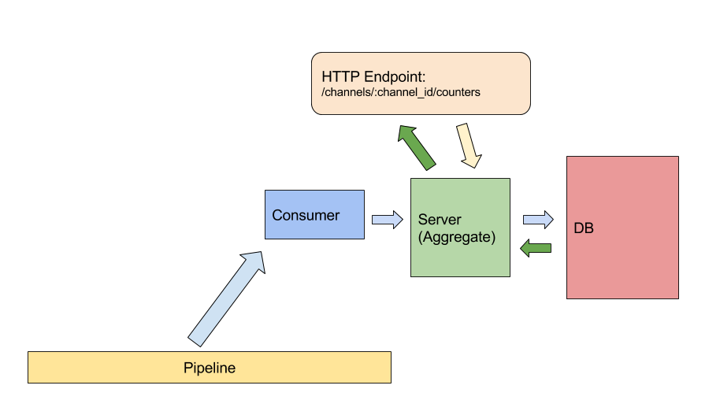
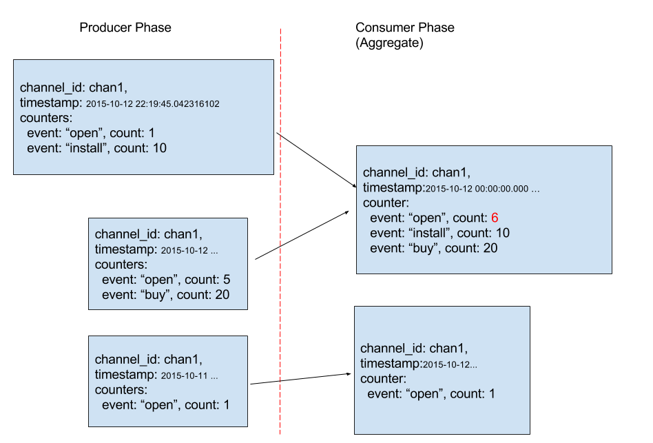

# Architecture

## Consuming from Data Pipeline

We have three components to process messages from data pipeline:

- Consumer: A consumer adaptor that conforms to messaging queue interface and fetches data.
- Server: Business logic to implement aggregation.
- HTTP Endpoint: parse user request and reply results from server to user.
- DB: Storage backend that persists data.
We can delegate some logic to DB as well,
e.g. update, inc, aggregate, and filtering are all can be done in MongoDB.



## Counter Business Logic

All counter events will be aggregated as a KV entry:
```
(channel_id, event, timestamp_based_on_granularity)=count
```

For example, if granularity is "day", and if the server
receives two events `(chan1, install, "2015-10-12")=1` and
`(chan1, install, "2015-10-12")=5`, then the two events will be
aggregated to one result `(chan1, install, "2015-10-12")=6`.

Implementation details (MongoDB):
We do [grouping](http://docs.mongodb.org/manual/reference/operator/aggregation/sum/) to provide aggregated results.
- It's more efficient.
- It's easier to implement.

However, we don't solve the problem of timezone at the moment.
Mongo/mgo by default stores times as ISODate in UTC.
For example, if the current time in PST isn
```
2015-10-13 11:05:38.863386001 -0700 PDT
```

It's stored (by mgo) in mongo as
```
ISODate("2015-10-13T18:05:38.863Z")
```
If we do grouping in mongo, let's say granularity is day,
we might end up getting results grouped on UTC days.

TODO: a solution is that we do the following things:
- calculate offset
- do projection based on offset
- do grouping


