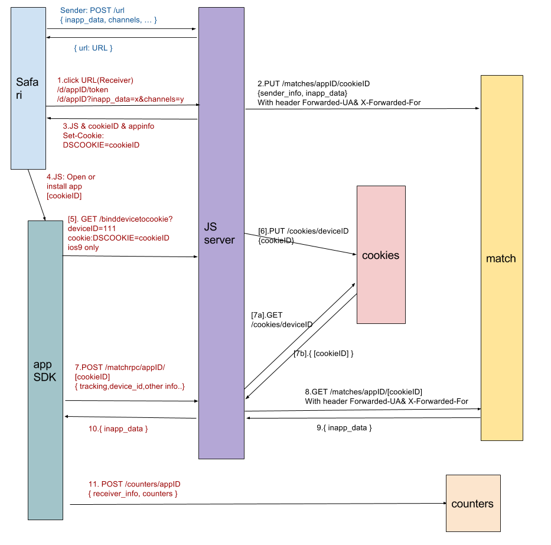

This document serves the official guide of REST API exposed by DeepShare service.

Our primary goal is to improve developer experience.

## Definition

### Deepshare Backend

Backend services of deepshare, consisted of Matching, Cookie, Counters and DSActions.

#### Matching
User can use our matching service to share in-app data across apps.
For example, content sharing, referrals and invites, installs tracking, etc.

#### DeviceCookie
We will create a cookie named DEEPSHARE_COOKIE for every client browser accessing our JS server, and store the cookie content (we name it cookieID) under the same device's deviceID.
Cookie maintains a collection of deviceID:cookieID pairs. User can add/modify a pair, or get cookieID provided deviceID. We can also manually bind some deviceID to cookieID by offline data analyse.

#### AppCookieDevice
We store the deviceID under a cookieID, for each appID respectively. 
When a device accesses deepshare server with both deviceID and cookieID, we pair them under the appID.
When the device accesses a DeepShare url with cookie, we can judge if the app has been installed by retrieving deviceID under cookieID, so that the browser can determine to redirect to app page(open) or app store(install). 

#### DSActions
Called by deepshare SDK or deepshare JS code in webpage. Simply push a event(i.e. "close", "preinstall", "rejectinstall", etc.) to message queue for future data analyse. 

#### Counters
Along with matching service, we provide counter service to help user record
a counter which is very useful for full attribution.

### Deepshare Frontend - JS server
A frontend of deepshare, handles user requests by calling related backend services and renders some html pages and JS code.

#### SharelinkFront
Serves as a web server when DeepShare url is accessed.

#### InappData
Response in-app data to recover app content.  

#### UrlGenerator
Generate DeepShare url.

#### BindDeviceToCookie
Frontend of DeviceCookie.

### Deepshare FrontendPlus

#### DSUsage
Get counter of opens and installs introduced by sharing of a certain Sender.

### Tracking Info
Parties:
- SenderInfo
- ReceiverInfo

Tracking properties of Sender:
- sender_id: sender identity, unique within app, could be sender deviceID, phone number, etc.
- channels: wechat, baidu, search keyword, etc.
- tags
- campaign
- feature

Tracking properties of Receiver:
- device_id
- carrier
- other information

