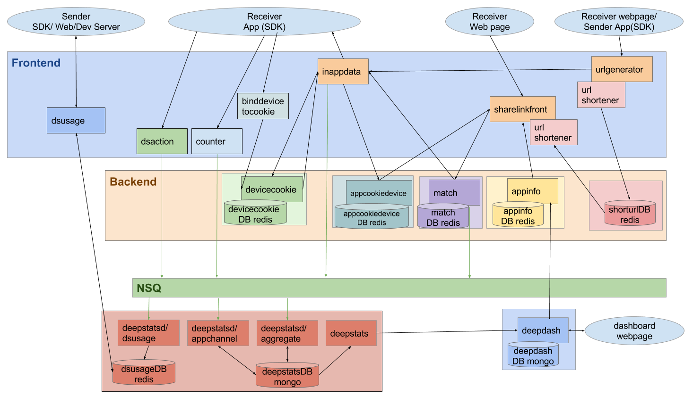

#Deepshare2 Deployment Reference

We have two groups of instances in deepshare2:
 
- **Frontend** instances need to be exposed to public network
- **Backend** instances are internal services called by Frontend

##Frontend instances
- inappdata
- sharelinkfront
- urlgenerator
- jsapi
- dsaction
- counter
- binddevicetocookie
- dsusage (different with other frontend instances, dsusage data is from NSQ consumer aggregation)

##Backend services
- appcookiedevice (called by sharelink and inappdata)
- devicecookie
- match
- appinfo
- token
- shorturl (DB only)

##Routing table (url path to instance)

```
/v2/url/                urlgenerator
/v2/inappdata/          inappdata
/d/                     sharelinkfront
/jsserver/              sharelinkfront
/v2/jsapi/              jsapi
/v2/binddevicetocookie/ binddevicetocookie
/v2/dsusages/           dsusage
/v2/dsactions/          dsaction
/v2/counters/           counter
/v2/matches/            match
/v2/appinfo/            appinfo
/v2/tokens/             token
/v2/appcookiedevice     appcookiedevice
/v2/devicecookie/       devicecookie
```

#DeepStats Deployment

We need for instances for deepstats：

- deepstatsd-aggreagete
- deepstatsd-appchannel
- deepstatsd-dsusage
- deepstats-api

They share the same mongoDB.

`deepstats-api` serves the APIs for deepdash, with the following path:

```
/v2/apps/:appID/channels

/v2/channels/:channel/counters
```

